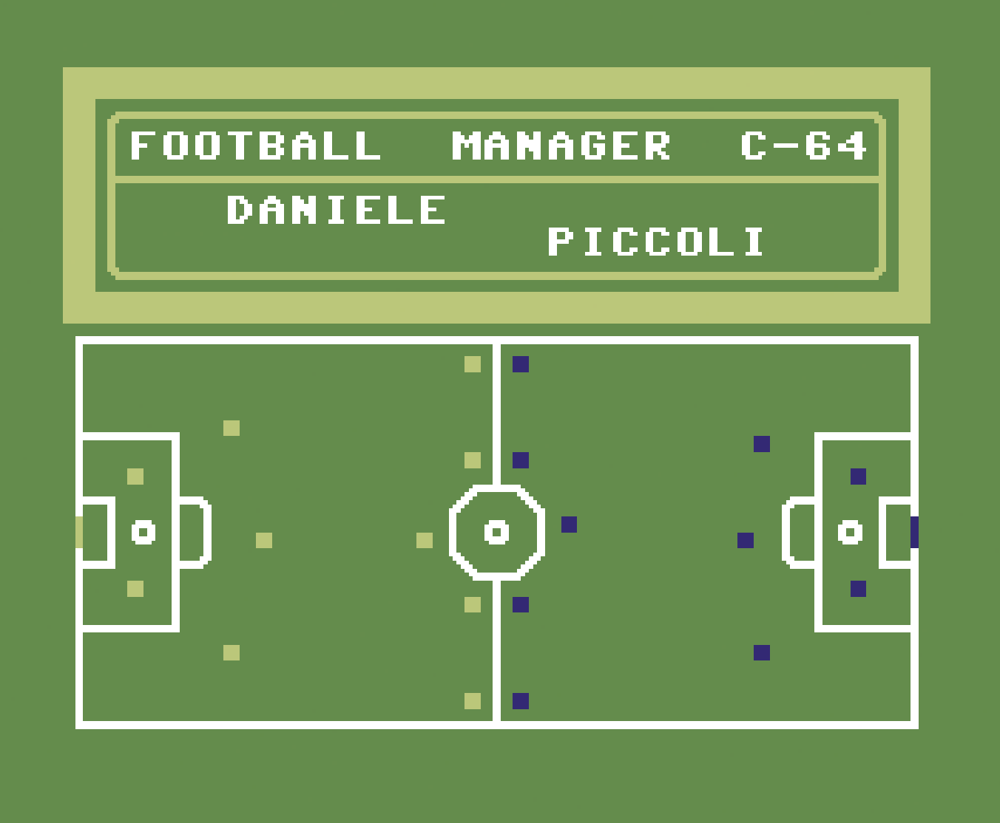

# Football Manager C-64

<p align="center">
  <a href="https://ai.enzolombardi.net/"></a>
</p>


A football (soccer) management game written for the Commodore 64 in BASIC by Daniele Piccoli in the 1980s, preserved here and made runnable on modern machines.

Rather than rewriting the game, this project ships **`c64basic`**, a small Commodore 64 BASIC V2 interpreter in Rust that runs the original listing unmodified and renders the C64's 40x25 PETSCII screen into a terminal with Unicode and ANSI colors. The original binary, ROM, and timing are treated as the specification; the interpreter is checked against the real machine in VICE, byte for byte.


## Quick start

```bash
# Play the original Italian game at authentic C64 speed
cargo run --release -p c64basic -- footballmanager.txt

# Full native speed, or a multiple of C64 speed
cargo run --release -p c64basic -- --speed max footballmanager.txt
cargo run --release -p c64basic -- --speed 4  footballmanager.txt
```

Press keys to play; `Ctrl-C` quits.

### Command-line flags

| Flag | Effect |
|------|--------|
| `--speed <mult>` \| `max` | Scale execution speed. Default paces to ~600 BASIC statements/sec so delay loops and animations run at real C64 speed; `max` is unthrottled. |
| `--keyport <port>` | Open a localhost TCP socket; bytes received are injected as keypresses. For scripted/automated play. |
| `--seed <n>` | Seed the RNG so `RND` is reproducible (deterministic runs and tests). |
| `--headless <n>` | Run `n` statements with no UI and dump the final screen. |
| `--parse-only` | Parse the listing and report line count without running. |

Scripted play example:

```bash
cargo run --release -p c64basic -- --speed max --keyport 6464 footballmanager.txt &
printf '8\r' | nc 127.0.0.1 6464   # choose team 8
printf 'G'   | nc 127.0.0.1 6464   # play the match
```

## Game variants

| File | Description |
|------|-------------|
| `footballmanager.txt` | Original Italian game in petcat format (the interpreter's input). Kept intact, bugs and all. |
| `footballmanager.bas` / `.prg` | Original listing / tokenized C64 binary. |
| `football-manager-ita-fixed.bas` / `.prg` | The Italian game with fixes for bugs found in the original listing. |
| `football-manager-intl.bas` / `.prg` | International edition: a European superleague of 64 clubs in four divisions (A–D, alphabetized), English text, currency scaled to modern values, players from the last decade, and 3 points for a win. Includes the bug fixes. |

The `.prg` files are `petcat`-tokenized and run on real C64 hardware or in VICE. Original scoring is 2 points per win (historically accurate); the international edition uses 3.

## How the match is simulated

The engine is a few dozen lines of arithmetic driven by `RND`, with no ball physics. Your team is five numbers: energy (average player power, which fatigues and recovers weekly), morale, and the summed style ratings of your defenders, midfielders, and forwards. These fold into a defense rating (`defense + midfield/2 + energy/2 + morale/2`) and an attack rating (`attack + defense_rating/2 + defense/2 + midfield/2`). The AI opponent has no roster; its stats are generated on match day from its league points. A goal is scored when a random draw from the attacker's attack rating beats a random draw from the defender's defense rating (`RND(attack) - RND(defense) > 0`), and the number of chances per half scales with how attack-heavy both sides are. After the match, morale, gate receipts, fatigue, and injuries feed the next week.

`CONVERSION_NOTES.md` and `footballmanager_documented.txt` document the formulas and variable mappings; `POSSIBLE-BUGS.md` catalogs the defects found in the original listing.

## The interpreter

`c64basic` is a workspace crate with a small, boring pipeline: a lexer and parser for petcat-format BASIC, a tree-walking interpreter that pokes PETSCII bytes into a 40x25 screen buffer (mirroring C64 screen memory), and a renderer that translates the buffer to Unicode and color only at draw time.

The PETSCII-to-Unicode glyph tables were verified against the actual C64 character generator ROM (`chargen-901225-01.bin`, shipped with VICE) rather than online charts. When changing a mapping, check the 8x8 bitmap in the ROM first.

## Tests

```bash
cargo test
```

The suite includes keyboard/INPUT delivery tests, determinism tests, a full-season playthrough of the international edition (screen-driven, exercising promotion and season-end), and **golden-screen tests** that run the original listing headlessly and compare the 40x25 screen against fixtures captured from VICE's screen memory. To regenerate a fixture, drive `footballmanager.prg` in VICE to the wanted screen and dump 1000 bytes at `$0400`.

## Reference documentation

- `CONVERSION_NOTES.md` — BASIC variable and algorithm notes
- `footballmanager_documented.txt` — annotated original listing
- `POSSIBLE-BUGS.md` — defects found in the original code
- `NOTES.md` — PETSCII / graphics research notes
- `HOW-TO-PLAY.md` — gameplay guide
- `porting-c64-games-to-rust.md` — a write-up of the porting work

## Credits

Original game by **Daniele Piccoli** (1980s). Preservation, interpreter, and editions in this repository build on that work, which is kept for educational and archival purposes.
