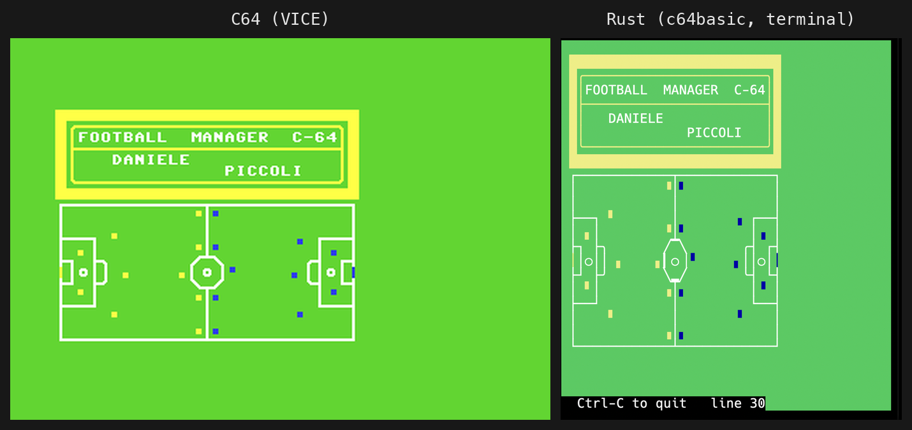
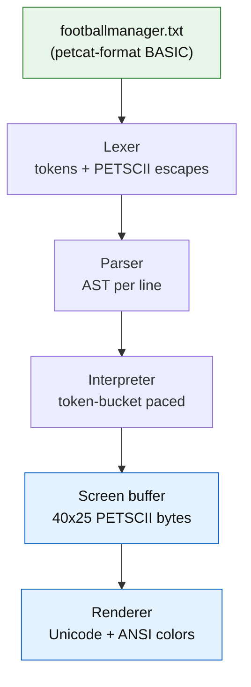

# Porting C64 Games to Rust

In 1985 Daniele Piccoli wrote a football management game in Commodore 64 BASIC and mailed it, presumably on cassette, into the small universe of Italian home computing. Forty years later the game still runs, but the machine it was written for exists mostly in emulators and in the memories of people who once waited through its loading screen. The interesting question is not whether you can rewrite a game like this in Rust. Of course you can; it's a few hundred lines of arithmetic and PRINT statements. The interesting question is what "porting" should mean when the source material is a piece of history.

There are two honest answers. You can translate the game logic into idiomatic Rust and build a modern terminal UI around it, which preserves the rules but discards the artifact. Or you can preserve the artifact itself: write an interpreter that runs the original BASIC listing, character graphics and all, inside a modern terminal. This project ended up doing both, and the second path turned out to be where all the hard lessons live.



The screenshot above is the payoff. On the left, the original PRG running in VICE. On the right, the same unmodified listing interpreted by a Rust program drawing into an ordinary terminal with Unicode and ANSI colors. Same title box, same pitch, same little players. Getting those two images to agree took more archaeology than engineering.

## Two ports, one game

The repository holds both approaches side by side. The first is a conventional rewrite: `GameState`, `Player`, and `Team` structs, a match engine that reproduces the original formulas, and a ratatui interface. It plays well, but every screen is an interpretation. The second is `c64basic`, a small interpreter crate that consumes the original listing in petcat format, the textual encoding VICE uses where control characters appear as `{clr}`, `{down}`, or `{$dd}`.

The interpreter pipeline is deliberately boring:



The screen buffer is the load-bearing decision. The interpreter does not print anything; it pokes PETSCII bytes into a 40 by 25 grid, exactly like the C64 wrote screen codes into memory at $0400. A separate renderer walks the grid at 50 Hz and translates each byte to a Unicode glyph and a terminal color. Keeping the buffer in PETSCII means the translation problem stays in one function, and that function is where this port nearly died.

## The character ROM is the only source of truth

CBM BASIC strings are full of graphics characters. The pitch in Football Manager is drawn from bytes like `{$dd}` (a vertical bar), `{$c0}` (a horizontal bar), and `{$b0}`/`{$ae}` (corners). Map those bytes to the wrong Unicode glyphs and the pitch dissolves into the abstract art you may remember from bad ROM dumps: slashes where corners should be, checkmarks in the penalty area.

The first version of the mapping table was written from memory and from charts found online, and it was wrong in a dozen places. Reference charts disagree with each other, because PETSCII has two character sets, because print codes differ from screen codes, and because half the internet confuses the CBM-key graphics block with the shifted-letter block. The fix was to stop trusting charts entirely. VICE ships the actual character generator ROM, `chargen-901225-01.bin`, 8 bytes per glyph, one bit per pixel. A ten-line Python script renders any byte as ASCII art:

```text
$B0 (screen 70):          $D5 (SHIFT-U):
........                  ........
........                  ........
........                  ........
...#####                  .....###
...#####                  ....####
...##...                  ...###..
...##...                  ...##...
...##...                  ...##...
```

Now the mapping is a matter of looking: `$B0` is a square top-left corner, so it becomes `┌`; `$D5` is rounded, so it becomes `╭`. The final table in the interpreter reads like an inventory of small certainties:

```rust
0xC9 => '╮', // SHIFT-I, top-right rounded corner
0xCA => '╰', // SHIFT-J, bottom-left rounded corner
0xCD => '╲', // SHIFT-M, diagonal
0xCE => '╱', // SHIFT-N, diagonal
0xD1 => '●', // SHIFT-Q, filled circle
0xD7 => '○', // SHIFT-W, hollow circle
```

One structural fact fell out for free: bytes `$60` to `$7F` map to the same ROM glyphs as `$C0` to `$DF`, so the second range is defined as a one-line delegation to the first. That is not an optimization; it is what the hardware does, and encoding hardware facts as code structure is the closest thing this kind of project has to a design principle.

## Emulating slowness on purpose

The first time the interpreter ran the full game, the splash screen was invisible. Not broken: too fast. The original paces itself with empty delay loops, `FOR TR=1 TO 500: NEXT`, which burn real time at 1 MHz and evaporate in native code. A Rust interpreter executes a couple of million BASIC statements per second; the goal animation, twenty ball movements with delay loops between them, completed between two frames of the renderer.

So the interpreter throttles itself with a token bucket. An empty FOR/NEXT loop on real hardware runs at roughly 600 iterations per second, so the bucket earns 600 statements per second and the main loop spends them:

```rust
earned = (earned + now.duration_since(last_exec).as_secs_f64() * rate).min(rate);
let budget = earned as u32;
earned -= budget as f64;
```

The cap at one second of backlog matters: without it, any stall (a window resize, a debugger pause) would bank thousands of statements and release them as a burst, skipping the very animations the throttle exists to preserve. A `--speed` flag scales the rate, and `--speed max` removes it for testing. Emulating a slow machine turns out to mean emulating its slowness.

## Let the original testify

How do you know a port is faithful? You ask the original. VICE, the venerable Commodore emulator, now exists in a build with an embedded MCP server, which means an AI agent (or any HTTP client) can load the original PRG, press keys, read memory, and take screenshots of the genuine article. Every screen in the Rust interpreter was compared against a screenshot of the same moment in VICE. The comparison image at the top of this post is exactly that workflow, promoted from test artifact to illustration.

The same idea, applied to the Rust side, produced a small feature with outsized returns: a `--keyport` flag that opens a localhost TCP socket and injects received bytes as keypresses. Suddenly the whole game is scriptable:

```bash
c64basic --speed max --keyport 6464 footballmanager.txt &
printf '15\n' | nc 127.0.0.1 6464   # choose team 15
printf 'G'    | nc 127.0.0.1 6464   # play the match
```

Automated play at maximum speed is how the financial formulas, the league table sorting, and the three-points patch for the international edition were verified without a human mashing the space bar.

## Inside the match engine

Fidelity only matters if you know what you are being faithful to, so it is worth unpacking how the game actually decides that Juventus beat you 1-0. The whole simulation fits in perhaps forty lines of BASIC, and it is a nice specimen of 8-bit game design: no ball physics, no player positions, just a handful of numbers colliding through `RND`.

Your side is summarized by five values. Energy is the average power of your eleven fielded players, power being a per-player stat from 1 to 20 that drops by 1 each week a player is fielded and recovers by 10 when he rests. Morale is a club-wide number from 1 to 20 that the results of previous matches push around. Defense, midfield, and attack are the summed style ratings (1 to 5, the player's innate quality) of the players you fielded in each third of the squad list; the first eight players in the roster are defenders, the next eight midfielders, the last eight forwards, and where you field them is your formation. These five collapse into two composite ratings:

```basic
20180 D(6)=INT(D(3)+D(4)/2+D(1)/2+D(2)/2)      : REM defense rating
20190 D(7)=INT(D(5)+(D(6))/2+(D(3))/2+(D(4))/2): REM attack rating
```

Defense is defense plus half of each of midfield, energy, and morale. Attack is your attack skill plus half your own defense rating and half of defense and midfield again. Everything feeds everything; a demoralized, exhausted team attacks worse even with Mbappé up front. (The line above shows the repaired formula. As shipped in 1985, `D(7)` started from itself, freshly zeroed, instead of `D(5)`, so your forwards' skill never reached the pitch. More on that in a moment.)

The opponent is cheaper to build. The AI has no roster at all: its five stats are generated on match day from its league points, `D(PZ)=INT(RND(1)*(G(A1)/I*3)+10)`, which reads as "a random number scaled by points-per-match, plus a floor of 10, capped at 20." A team at the top of the table shows up strong, a struggling one shows up weak, and nobody pays its wage bill. The same two composite formulas then produce the opponent's defense and attack ratings.

The match itself is a loop over chances, and the number of chances is governed by a tempo variable that measures how open the game is:

```basic
20200 HZ=D(7)-D(13)+D(14)-D(6):IFHZ<10THENHZ=15
3430 IFINT(RND(1)*HZ)+1>9THENGOSUB20270 : REM a chance happens
3440 IFINT(RND(1)*HZ)+1>3THEN3430       : REM ...and the half goes on
```

`HZ` is both attacks minus both defenses: two attack-heavy sides produce a large `HZ`, which makes the inner rolls exceed their thresholds more often, which means more chances and a longer half. Two defensive sides strangle the loop early. Each chance flips a coin to pick the attacking side, then resolves with the game's one essential formula:

```basic
20290 IFINT(RND(1)*D(14)-RND(1)*D(6))>0THENH(A4)=H(A4)+1 : REM they score
20310 IFINT(RND(1)*D(7)-RND(1)*D(13))>0THENH(A3)=H(A3)+1 : REM you score
```

A goal is a random draw from the attacker's attack rating beating a random draw from the defender's defense rating. That is the entire theory of football on offer: your rating buys you a bigger die, not a guaranteed win, and a 20-versus-10 mismatch still ships the occasional 0-0. It is crude and it works, which is why the Rust rewrite reproduces it digit for digit rather than replacing it with something respectable.

After the final whistle the numbers loop back into next week. Winning lifts morale by `(20-K)/2`, drawing resets it toward the middle, losing knocks it down; gate receipts scale with your league position; fielded players lose power, resting players regain it, and a tired player with power below 12 risks injury on a roll of `RND(1)*B(HZ)<=2`. Every input of the next simulation is an output of this one, which is what makes an eight-match season feel like a campaign instead of a slot machine.

## The listing pushes back

Run a 1985 listing under a magnifying glass and it confesses. Static analysis plus scripted play turned up real defects in the original. The goal animation counter `GIR` is never reset, so the exact-equality exit test `IF GIR=20` can only succeed once per session; every goal after the first should loop forever. The substitution prompt accepts the key Y, index 25, into arrays dimensioned to 24, a guaranteed `BAD SUBSCRIPT` crash. Your team's attack rating is computed from itself (freshly zeroed) instead of from the attack skill, so your strikers never mattered; the opponent's formula is correct. And one line hides `GOTO3805` inside a string literal, so when you go broke the game literally prints `:GOTO3805` on screen instead of jumping.

None of this is mockery. It is what shipping looked like when your debugger was a television set. But it sharpens the porting question: the faithful interpreter reproduces the bugs, the fixed edition (`football-manager-ita-fixed.bas`) repairs them, and both are legitimate ports of different things, one of the artifact and one of the intent.

## What the pitch taught about preservation

The Rust rewrite took an afternoon. The interpreter that renders the original listing took character ROM archaeology, a deliberate slowness budget, and an emulator acting as an expert witness. That asymmetry is the lesson. Game logic is portable almost by accident; it is arithmetic, and arithmetic doesn't age. What ages is everything around it: the character set, the timing assumptions, the 40-column screen, the habit of using the machine's quirks as free features. Porting the logic gives you a new game with an old rulebook. Porting the artifact means treating the original binary, ROM, and timing as specifications, and those specifications are checkable, byte by byte, against a running original.

If you try this yourself, start with the screen buffer in the native encoding and translate at the last possible moment, get the real character ROM before writing a single glyph mapping, and give your interpreter a speed limit before you conclude that animations are missing. The original is not just the thing you are porting. It is the best test oracle you will ever have.

[Rust](https://medium.com/tag/rust), [Retro Gaming](https://medium.com/tag/retro-gaming), [Emulation](https://medium.com/tag/emulation), [Commodore 64](https://medium.com/tag/commodore-64), [Programming](https://medium.com/tag/programming)

---

Want more like this?
I write regularly about Rust, design patterns, and performance tips.
Follow me here [on Medium](https://enzolombardi.net) to stay updated.
